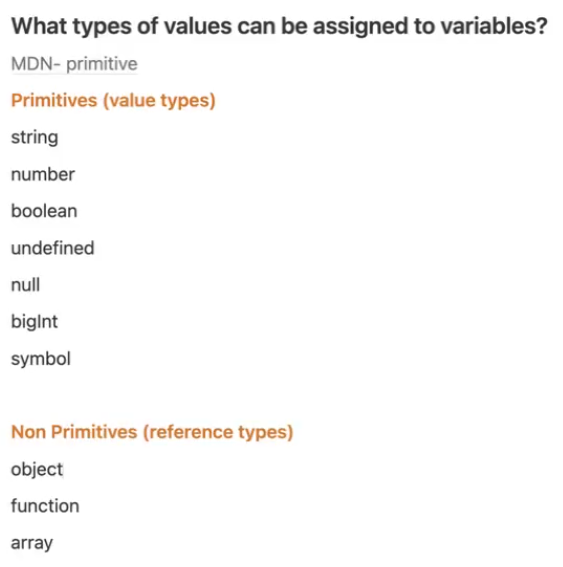
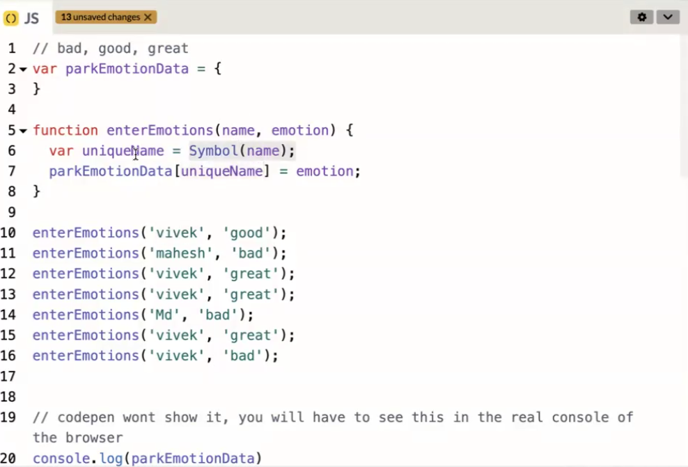

first select then : shift+alt+down
> Control + Space gives you more options.

crtl+shift+p > live server

select ctrl + D : make changes then double esc.. .Voila its done

> maps are not itirable where objects and arrays are.

Object and Array are same, they were invented for same purpose
in object we can take any key where, in array it starts from 0

> <h2>Hello</h2>
so simply put your cursor nest to h2 like, <h2|>
and same time take  your mouse and hit mourse to next closed element like, </h2|> voila, you can now edit the element at same time

<!-- <pre>

</pre> -->

> from vivek sir class

    -   symbols