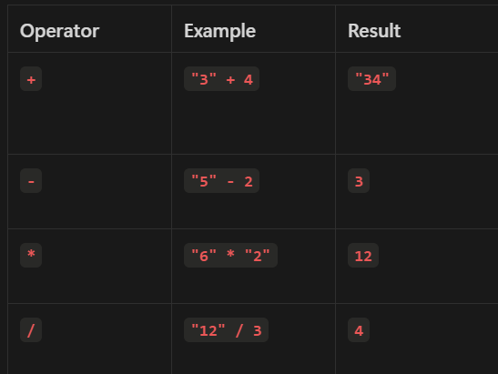
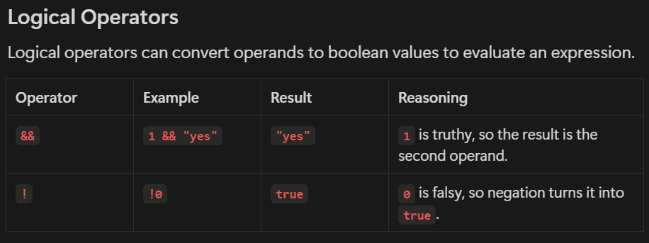

> Type coercion in JavaScript is the automatic or implicit conversion of values from one data type to another. 

> This conversion can occur in various contexts, such as during arithmetic operations, logical operations, or when working with strings and booleans. 

> Coercion makes JavaScript a very flexible language, but it can also lead to unexpected results if not properly understood.

> Arithmetic Operators

> 

> 

- '5' == 5  "true"
- true == 1 "true"
- null == undefine "true"
    -   null == 0 "false"
    -   undefined == 0 "false"
- '0' == false "true"
- 'true' == true "false"
- 5 + " apples" "5 apples" //String Concatenation
- +"3.14" 3.14 //Unary Operators

- **`2 * null`** becomes **`2 * 0`** because **`null`** is coerced to **`0`**.
- **`true + true`** becomes **`1 + 1`** because **`true`** is coerced to **`1`**.