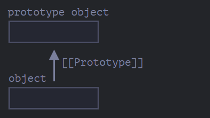
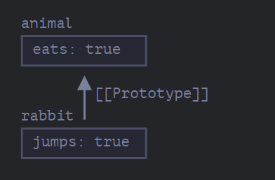

# [[Prototype]]

- In JavaScript, objects have a special hidden property [[Prototype]] (as named in the specification), that is either null or references another object. That object is called “a prototype”:



When we read a property from object, and it’s missing, JavaScript automatically takes it from the prototype. In programming, this is called “prototypal inheritance”

- The property [[Prototype]] is internal and hidden, but there are many ways to set it.
  - One of them is to use the special name `__proto__`, like this:


```
let animal = {
  eats: true
};
let rabbit = {
  jumps: true,
  __proto__:animal //you can do this too, line 19.
};

rabbit.__proto__ = animal; (*)// sets rabbit.[[Prototype]] = animal

- Now if we read a property from rabbit, and it’s missing, JavaScript will automatically take it from animal.

// we can find both properties in rabbit now:

alert( rabbit.eats ); // true (**)
alert( rabbit.jumps ); // true

Here the line (*) sets animal to be the prototype of rabbit.

Then, when alert tries to read property rabbit.eats (**), it’s not in rabbit, so JavaScript follows the [[Prototype]] reference and finds it in animal (look from the bottom up):
```


Here we can say that "animal is the prototype of rabbit" or "rabbit prototypically inherits from animal".

So if animal has a lot of useful properties and methods, then they become automatically available in rabbit. Such properties are called “inherited”.

### The prototype chain can be longer:

```
let animal = {
  eats: true,
  walk() {
    alert("Animal walk");
  }
};

let rabbit = {
  jumps: true,
  __proto__: animal
};

let longEar = {
  earLength: 10,
  __proto__: rabbit
};

// walk is taken from the prototype chain
longEar.walk(); // Animal walk
alert(longEar.jumps); // true (from rabbit)
```

> There are only two limitations:
- The references can’t go in circles. JavaScript will throw an error if we try to assign __proto__ in a circle.
- The value of `__proto__` can be either an object or null. Other types are ignored.

## Writing doesn’t use prototype
```
let animal = {
  eats: true,
  walk() {
    /* this method won't be used by rabbit */
  }
};

let rabbit = {
  __proto__: animal
};

rabbit.walk = function() {
  alert("Rabbit! Bounce-bounce!");
};

rabbit.walk(); // Rabbit! Bounce-bounce!
```
From now on, rabbit.walk() call finds the method immediately in the object and executes it, without using the prototype:

## For loop
```
let animal = {
  eats: true
};

let rabbit = {
  jumps: true,
  __proto__: animal
};

alert(Object.keys(rabbit)); // jumps

for(let prop in rabbit) alert(prop); // jumps

##Further more
##Further more

for(let prop in rabbit) {
  let isOwn = rabbit.hasOwnProperty(prop);

  if (isOwn) {
    alert(`Our: ${prop}`); // Our: jumps
  } else {
    alert(`Inherited: ${prop}`); // Inherited: eats
  }
```


