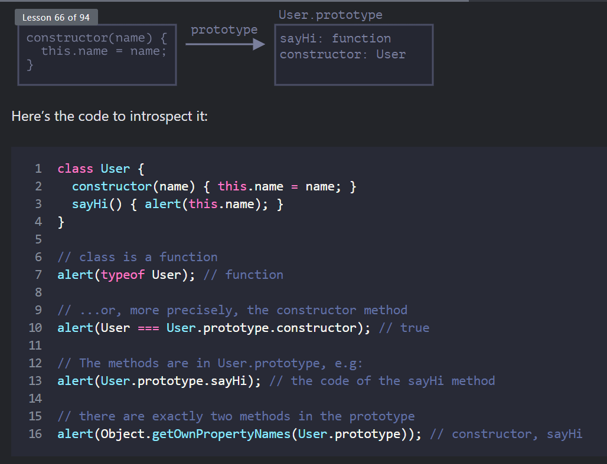

# Class basic syntax

- In JavaScript, a class is a kind of function.
```
class User {
  constructor(name) { this.name = name; }
  sayHi() { alert(this.name); }
}

// proof: User is a function
alert(typeof User); // function

- Creates a function named User, that becomes the result of the class declaration. The function code is taken from the constructor method (assumed empty if we don’t write such method).
- Stores class methods, such as sayHi, in User.prototype.
```



## Not just a syntactic sugar
- Sometimes people say that class is a “syntactic sugar” (syntax that is designed to make things easier to read, but doesn’t introduce anything new), because we could actually declare the same thing without using the class keyword at all:

```
// rewriting class User in pure functions

// 1. Create constructor function
function User(name) {
  this.name = name;
}
// a function prototype has "constructor" property by default,
// so we don't need to create it

// 2. Add the method to prototype
User.prototype.sayHi = function() {
  alert(this.name);
};

// Usage:
let user = new User("John");
user.sayHi();

```