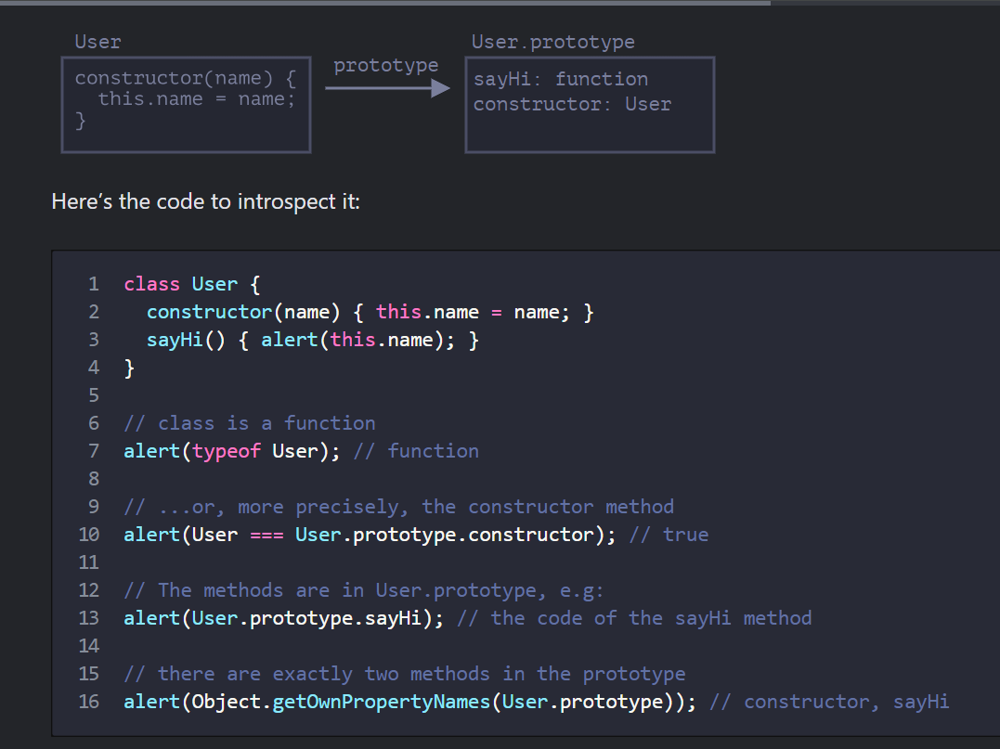
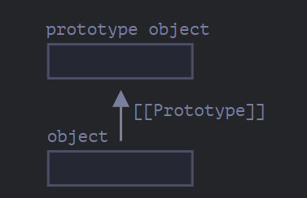
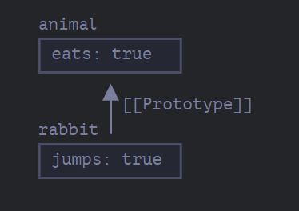
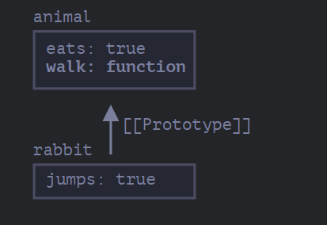
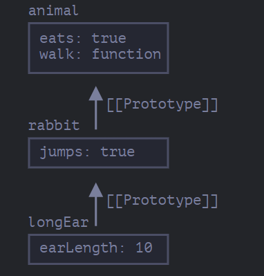

# What is a class?
> In JavaScript, a class is a kind of function.
```
class User {
  constructor(name) 
      { this.name = name; }
  sayHi() 
      { alert(this.name); }
}

// proof: User is a function
alert(typeof User); // function
```
> What class User {...} construct really does is:
- Creates a function named User, that becomes the result of the class declaration. The function code is taken from the constructor method (assumed empty if we don’t write such method).
- Stores class methods, such as sayHi, in User.prototype.




//Prototypes, inheritance

//[[Prototype]]

//In JavaScript, objects have a special hidden property [[Prototype]] (as named in the specification), that is either null or references another object. That object is called “a prototype”:



//When we read a property from object, and it’s missing, JavaScript automatically takes it from the prototype. In programming, this is called “prototypal inheritance”

```
let animal = {
  eats: true
};
let rabbit = {
  jumps: true
};

rabbit.__proto__ = animal; // (*) //sets rabbit.[[Prototype]] = animal

// we can find both properties in rabbit now:
alert( rabbit.eats ); // true (**)
alert( rabbit.jumps ); // true

- Now if we read a property from rabbit, and it’s missing, JavaScript will automatically take it from animal.
- Here the line (*) sets animal to be the prototype of rabbit.
- Then, when alert tries to read property rabbit.eats (**), it’s not in rabbit, so JavaScript follows the [[Prototype]] reference and finds it in animal (look from the bottom up):
```

> Here we can say that "animal is the prototype of rabbit" or "rabbit prototypically inherits from animal".

> So if animal has a lot of useful properties and methods, then they become automatically available in rabbit. Such properties are called “inherited”.


```
let animal = {
  eats: true,
  walk() {
    alert("Animal walk");
  }
};

let rabbit = {
  jumps: true,
  __proto__: animal
};

// walk is taken from the prototype
rabbit.walk(); // Animal walk

- The method is automatically taken from the prototype, like this:
```
> 


```
# The prototype chain can be longer:


let animal = {
  eats: true,
  walk() {
    alert("Animal walk");
  }
};

let rabbit = {
  jumps: true,
  __proto__: animal
};

let longEar = {
  earLength: 10,
  __proto__: rabbit
};

// walk is taken from the prototype chain
longEar.walk(); // Animal walk
alert(longEar.jumps); // true (from rabbit)
```


Now if we read something from longEar, and it’s missing, JavaScript will look for it in rabbit, and then in animal.

There are only two limitations:

The references can’t go in circles. JavaScript will throw an error if we try to assign __proto__ in a circle.
The value of __proto__ can be either an object or null. Other types are ignored.
Also it may be obvious, but still: there can be only one [[Prototype]]. An object may not inherit from two others.