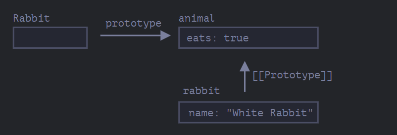
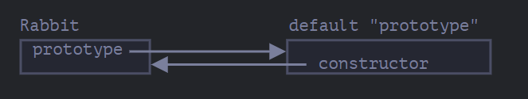
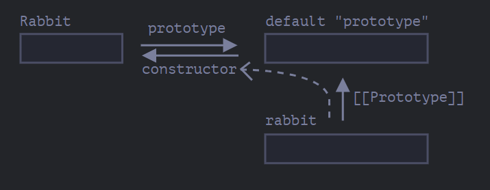

Remember, new objects can be created with a constructor function, like new F().

If F.prototype is an object, then the new operator uses it to set [[Prototype]] for the new object.

```
let animal = {
  eats: true
};

function Rabbit(name) {
  this.name = name;
}

Rabbit.prototype = animal;

let rabbit = new Rabbit("White Rabbit"); //  rabbit.__proto__ == animal

alert( rabbit.eats ); // true
```
- Setting Rabbit.prototype = animal literally states the following: "When a new Rabbit is created, assign its [[Prototype]] to animal".



On the picture, "prototype" is a horizontal arrow, meaning a regular property, and [[Prototype]] is vertical, meaning the inheritance of rabbit from animal.


## Default F.prototype, constructor property
function Rabbit() {}
// by default:
// Rabbit.prototype = { constructor: Rabbit }

alert( Rabbit.prototype.constructor == Rabbit ); // true


Naturally, if we do nothing, the constructor property is available to all rabbits through [[Prototype]]:

```
function Rabbit() {}
// by default:
// Rabbit.prototype = { constructor: Rabbit }

let rabbit = new Rabbit(); // inherits from {constructor: Rabbit}

alert(rabbit.constructor == Rabbit); // true (from prototype)
```

We can use constructor property to create a new object using the same constructor as the existing one.


```
function Rabbit(name) {
  this.name = name;
  alert(name);
}

let rabbit = new Rabbit("White Rabbit");

let rabbit2 = new rabbit.constructor("Black Rabbit");
```
