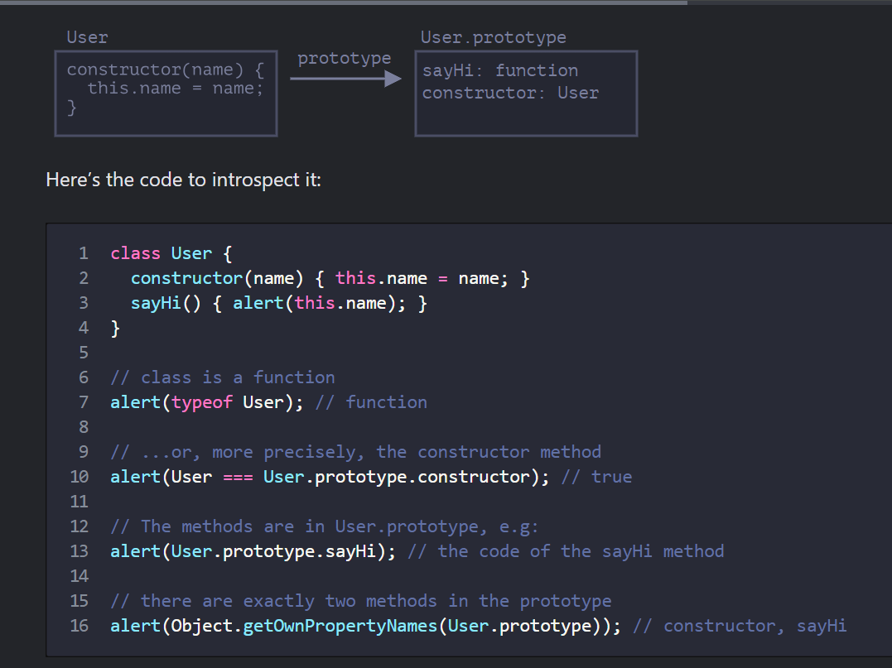

# What is a class?
> In JavaScript, a class is a kind of function.
```
class User {
  constructor(name) { this.name = name; }
  sayHi() { alert(this.name); }
}

// proof: User is a function
alert(typeof User); // function
```
> What class User {...} construct really does is:
- Creates a function named User, that becomes the result of the class declaration. The function code is taken from the constructor method (assumed empty if we don’t write such method).
- Stores class methods, such as sayHi, in User.prototype.



